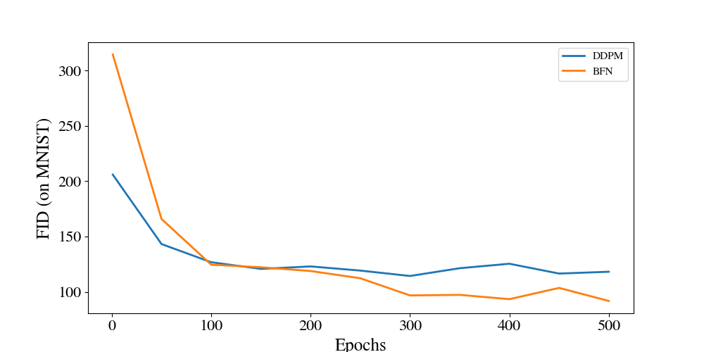
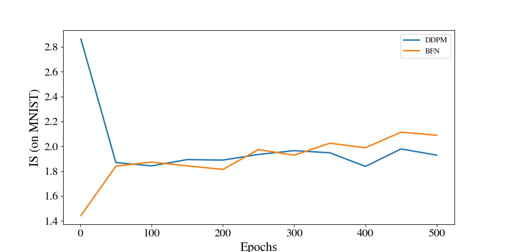
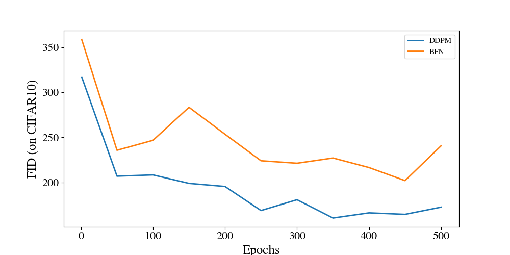
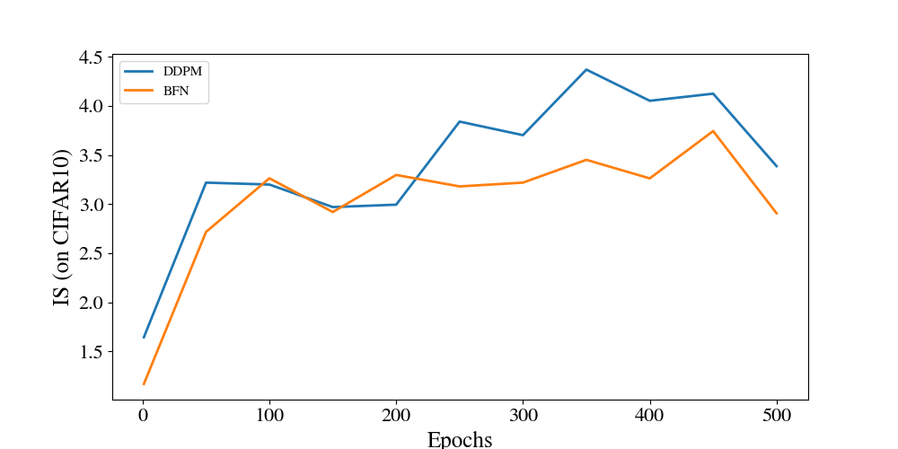
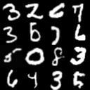
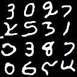
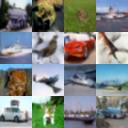
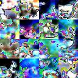

# Diffusion Models against Bayesian Flow Networks
In this repository, we compare the results of the original diffusion models as described by [Ho and al](https://arxiv.org/abs/2006.11239) in December 2020 (DDPM) to Bayesian Flow Networks (BFN), introduced about 3 years later by [Graves and al](https://arxiv.org/abs/2308.07037).

## Introduction
The diffusion approach marked a significant turn in the domain of generative AI for images, replacing the previous state-of-the-art GAN models with an innovative method: the images are built step by step instead of all in one go, starting by the general shapes and then refining the details by progressively denoising pure gaussian noise. On the other hand, Bayesian Flow Networks are a novel architecture based on the idea of learning the parameters of the data probability distribution, allowing to sample directly from this density instead of needing a denoising process. <br>
The Bayesian Flow Networks seem to be very promising, both in terms of flexibility (especially due to their ability to handle discrete data) and efficiency: according to the paper, they could be 10 times faster than the original diffusion models for similar or better results. <br>
In this repository, we try to compare diffusion models to BFN on two datasets (used as standard benchmarks in the domain of image generation), using different metrics (see [Methodology](#methodology)) to get more information. This comparison yield numerical [Results](#results), allowing us to gauge the potential the Bayesian Flow Networks have of replacing Diffusion Models in image generation tasks and becoming the new state of the art in this domain of Artificial Intelligence. Finally, we try to draw [Conclusions](#conclusions) about this study.
> Note: this is the source code of a study that has been conducted in greater details and reported in a more exhaustive document. If you are interested in reading the full study, including a summary of both theories and a lengthier discussion of both models and/or accessing the LaTeX source code of the document, feel free to [open en issue](https://github.com/brayevalerien/Diffusion-vs-BFN/issues/).

## Methodology
With the aid of the code opposite, we train both diffusion and BFN models on various datasets (that are commonly used for benchmarking image generation AI model). We then evaluate the trained models with common metrics.

### Compared architectures
The code used for training and testing both architectures are adapted from the source codes of their original implementation to stay as close as the authors' material.

#### Diffusion Models
The implementation we used for our experiments is derived from [the easy to understand DDPM implementation](https://github.com/dome272/Diffusion-Models-pytorch). Note that we only used the unconditional implementation (and thus discarded the CFG and EMA modules).
> We have decided to use the original implementation, which is very far from the current state of diffusion models that can achieve mind blowing results. This is because BFN have currently received very little attention and thus have not yet been improved through the iterative research processus that diffusion models benefited. Since we want to gauge the potential of BFN, it seemed natural to compare their current implementation, which is their first iteration, with the first iteration of the diffusion models.

#### Bayesian Flow Networks
We decided to use an [implementation of Bayesian Flow Networks](https://github.com/Algomancer/Bayesian-Flow-Networks) that is cleaner and more popular than the [original code](https://github.com/nnaisense/bayesian-flow-networks) to conduct our tests.


### Datasets
Firstly, we want to reproduce some of the results presented in the original papers of both architectures, that is why we are considering the following datasets:
- [MNIST](https://paperswithcode.com/dataset/mnist): 70000 images of handwritten digits, 28×28 pixels.
- [CIFAR-10](https://www.cs.toronto.edu/~kriz/cifar.html): 60000 32×32 color images in 10 classes, with 6000 images per class. There are 50000 training images and 10000 test images

### Metrics
In our experiments, we evaluate the trained models using two metrics that are often used for image generation task evaluation:
- IS (Inception Score), a metric base on the [InceptionV3](https://arxiv.org/pdf/1512.00567v3.pdf) classifier, evaluating how well the generated images can be classified and that they are diverse enough. This score has to be maximized.
- FID (Fréchet Inception Distance), which expresses a distance between two image distributions (the ground truth distribution and the obtained distribution in our case), that we thus want to minimize.

Since IS encourages diversity of the generated images and FID is improved when the generated images are close to the data distribution, we can intuitively understand that there is a compromise between these two scores: improving one will usually lead to worse results for the other one. This intuition has been confirmed by [Brock and al.](https://arxiv.org/abs/1809.11096) and [Jonathan Ho & Tim Salimans](https://arxiv.org/abs/2207.12598) and it is the reason why a generative model should aim at improving both score and not optimizing only one of them.

Several other scores have been proposed for evaluating image generation models, such as [improved precision and recall](https://research.nvidia.com/sites/default/files/pubs/2019-12_Improved-Precision-and/kynkaanniemi2019metric_paper.pdf), but we decided to focus on the IS and FID instead.

Another crucial criteria when choosing a model that has the potential of becoming widely used is the amount of computation (and time) it takes to train a model. That is why we not only measure the FID and IS metrics of the trained models, but we also compute this metrics for the models during their training. For each model, we save a checkpoint every 1000 epochs, and then plot the score of these checkpoints (see the [results](#results)) to observe the speed of convergence through the training curves. Additionally, we also time each epoch to compute the average epoch length in time.

### Training settings
The following table summarizes the setup and hyperparameters we used for training our models.
|                  | DDPM MNIST         | DDPM CIFAR10           | BFN MNIST              | BFN CIFAR10            |
| ---------------- | ------------------ | ---------------------- | ---------------------- | ---------------------- |
| Device           | NVIDIA RTX 3070 Ti | NVIDIA Quadro RTX 6000 | NVIDIA RTX 3070 Ti     | NVIDIA Quadro RTX 6000 |
| Number of epochs | 500                | 500                    | 500                    | 500                    |
| Learning rate    | 0.0003             | 0.0003                 | 0.0001                 | 0.0001                 |
| Batch size       | 32                 | 128                    | 1                      | 1                      |
| Image size       | 32                 | 32                     | 32                     | 32                     |

The architecture of the models remained the same between the two datasets, but the $\sigma$ hyperparameter of the BFN were set to different values for MNIST and CIFAR10 (MNIST being in black and white):
- $\sigma_{\text{MNIST}} = 0.5$
- $\sigma_{\text{CIFAR10}} = 0.032$


## Results
In this section, we summarize the results we have obtained with our experiments in order to prepare for drawing conclusions in the [next section](#conclusions).
### Metrics
#### Processing time
The following table shows the time taken per image, both for training and sampling the models. Due to the unchanged architectures and image size, the times remains consistent between the two datasets. Batch size was taken into account for the DDPM models.
| Model | Training       | Sampling     |
| ----- | -------------- | ------------ |
| DDPM  | 9.62 images/s  | 9.57 s/image |
| BFN   | 92.17 images/s | 0.31 s/image |

Training speed is an average over 500 epochs and sampling speed is an average over 500 images (256 images per dataset, once for each dataset and model).

#### Fréchet Inception Distance (↓)
> FID are given for the final models after 500 training epochs

|          | DDPM | BFN  |
| -------- | ---- | ---- |
| MNIST    | 118  | 91.8 |
| CIFAR-10 | 173  | 241  |

#### Inception Score (↑)
>IS are given for the final models after 500 training epochs

|          | DDPM | BFN  |
| -------- | ---- | ---- |
| MNIST    | 1.92 | 2.09 |
| CIFAR-10 | 3.39 | 2.91 |

### Training curves
|         | FID                                                                                           | IS                                                                                          |
| ------- | --------------------------------------------------------------------------------------------- | ------------------------------------------------------------------------------------------- |
| MNIST   |      |      |
| CIFAR10 |  |  |

### Generation samples
|         | DDPM                                                       | BFN                                                  |
| ------- | ---------------------------------------------------------- | ---------------------------------------------------- |
| MNIST   |      |  |
| CIFAR10 |  |  |


## How to reproduce the results yourself
### Installation and set up
> Before starting, make sure you have the followings installed:
> - [Git](https://git-scm.com)
> - [Python 3.10.11](https://www.python.org/downloads/release/python-31011/)
> - [Anaconda](https://www.anaconda.com)

Start by cloning this repository and `cd` into it:
```bash
git clone https://github.com/brayevalerien/Diffusion-vs-BFN
cd Diffusion-vs-BFN
```

Create a Conda environment under Python 3.10.11, activate it and install the required libraries:
```bash
conda create -n ddpm-vs-bfm python=3.10.11 -y
conda activate ddpm-vs-bfn
pip install -r requirements
```
> Make sure this environment is activated whenever you are working with this code base.

Since the Pytorch version required depends on your configuration, you will have to run a separate command for installing torch. The appropriate command can be obtained on the [get started page of Pytorch](https://pytorch.org/get-started/locally/), but usually looks like this: 
```bash
pip3 install torch torchvision torchaudio --index-url https://download.pytorch.org/whl/cu118
```

Finally, run [download_datasets.py](download_datasets.py) to download and converts the datasets locally. This might take some time, especially for large datasets such as CelebA.
```bash
python download_datasets.py
```

### Training models
#### Diffusion Models
If you want to train a model on the MNIST dataset using the same parameters as us for instance, from the root of this repo:
```bash
cd modules/diffusion_models/
python ddpm.py train --run_name mnist --dataset ../../datasets/MNIST/train/ --batch_size 32 --img_size 32
```
> Run `python ddpm.py train --help` to get more information on each argument.

#### Bayesian Flow Networks
If you want to train a model on the MNIST dataset using the same parameters as us for instance, from the root of this repo:
```bash
cd modules/bayesian_flow_networks/
python bfn.py train --run_name mnist --dataset ../../datasets/MNIST/train/ --sigma .5 --lr .0001 --img_size 32
```
> Run `python bfn.py train --help` to get more information on each argument.

### Testing models
#### Diffusion Models
If you want to sample from a model trained on the MNIST dataset using the same parameters as us for instance, from the root of this repo:
```bash
cd modules/diffusion_models/
python ddpm.py sample --n_img 16 --run_name mnist --model_path path/to/pretrained/model/ --img_size 32 --save_grid True
```
> Run `python ddpm.py sample --help` to get more information on each argument.

#### Bayesian Flow Networks
If you want to sample from a model trained on the MNIST dataset using the same parameters as us for instance, from the root of this repo:
```bash
cd modules/bayesian_flow_networks/
python bfn.py sample --n_img 16 --run_name mnist --model_path path/to/pretrained/model/ --sigma .5 --img_size 32 --save_grid True
```
> Run `python bfn.py sample --help` to get more information on each argument.

## Conclusions
### Analysis of the results
The first striking results from our experiments is the speed of the Bayesian Flow Networks compared to the Diffusion Models. Indeed they are way faster, both for training and sampling:
- for training, BFN are 9.6 times faster than Diffusion Models
- for sampling, BFN are 31 times faster than Diffusion Models

However, the speed of BFN does not mean anything without the performances metrics. The [training curves](#training-curves) are very convenient for this purpose. The results differ depending on the dataset on which the models where trained:
- for the MNIST dataset, the BFN seem to outperform the DDPM slightly: their FID keeps slowly decreasing after the DDPM FID plateaued. The BFN IS seems to go slightly about the DDPM IS, suggesting a better result of the BFN on this score too. However it's important to note the the IS is not that relevant on very specific datasets.
- on the CIFAR10 dataset, the FID evolution is similar for the two models but the overall FID score of the BFN is about 5 times the one of the DDPM, indicating worse performances from the first model. The BFN IS is also bit worse than the one of the DDPM even though the difference is less noticeable with this score. 

If the numerical results seem to be confirmed by the [generation samples](#generation-samples) on the trained MNIST models, where the BFN appear to sample slightly better looking images, the samples generated by the BFN model trained on the CIFAR10 dataset do not appear to be similar to the dataset, opposingly to the samples generated by the diffusion model trained on CIFAR10. These samples are more coherent and look like original images from the dataset.

The underwhelming results we obtained on the CIFAR10 dataset can in fact be explained by the architecture of the underlying network we choose. For the BFN, we use a basic U-Net network for training on both the MNIST and the CIFAR10 datasets. If this network seems to be enough to capture the simple distribution of the MNIST images, it appears to be too limited to fully express the distribution of the CIFAR10 dataset. The training curves for the BFN on the CIFAR10 were not improving after 200~300 epochs, indicating that the model was already at its maximum capacity, thus showing the limitation of the architecture used. In actuality, the network used in the original BFN paper is said to be a variational diffusion model, which can capture much more complex patterns.

### Discussion on the potential of BFN
As we could have expected, Bayesian Flow Networks have revealed some benefits but also some drawbacks compared to the more established Diffusion Models.

First of all, one of the most striking assets of BFN is their processing speed, which is vastly improved compared to DDPM: training is about 10 times faster and sampling is about 30 times faster. Considering the need of real time or embedded image generation, this improvement is full of hope for the future of image generation. However these factors will probably need to be revised since as we saw with the results, training a BFN model on a more complex dataset requires an internal network with more expression abilities, which would be a bit slower to train.
On simpler datasets like the MNIST, BFN models yield very promising results with slightly better scores than DPDM, while using a slightly less complex internal model (the U-Net in our DDPM is deeper than the one used in our BFN), showing the potential of the later models if they were developed a bit further.

It also is essential to take in account the incredible amount of research and development lead for the improvement of the Diffusion Models over the past few years, by the researchers but also by the community, which helped creating what DDPM are today. We believe that with the same amount of energy deployed for their development, Bayesian Flow Network could become a new state of the art architecture for generating images. Although it is important to note that these intense years that have been invested in the development of Diffusion Models are are double-edged. Indeed, switching from one well established paradigm to another might take some times since all current ressources are tailored for DDPMs.

### Limits of this study
The following points have not been studied or could be expanded upon in future work:
- training on other, more complex dataset: the two datasets we have used in this study (MNIST and CIFAR10) are great for proof of concept but quickly become limited due to their low variety and small image size. Testing the models on LSUN categories or Celeb A datasets for instance could reveal interesting results.
- studying the impact of using more complex architectures for the network of the BFN, that could empower them to capture more complex data distributions
- explore other data types: you focused our study on image generation but it has been shown that Diffusion Models, although design for image generation, have discrete data generation capabilities as well. Bayesian Flow Networks were designed with both continuous and discrete data in mind and according to their authors, it would be one of their fundamental strengths. Testing this affirmation was outside of the scope of this study but could add to the potential of BFN. 
